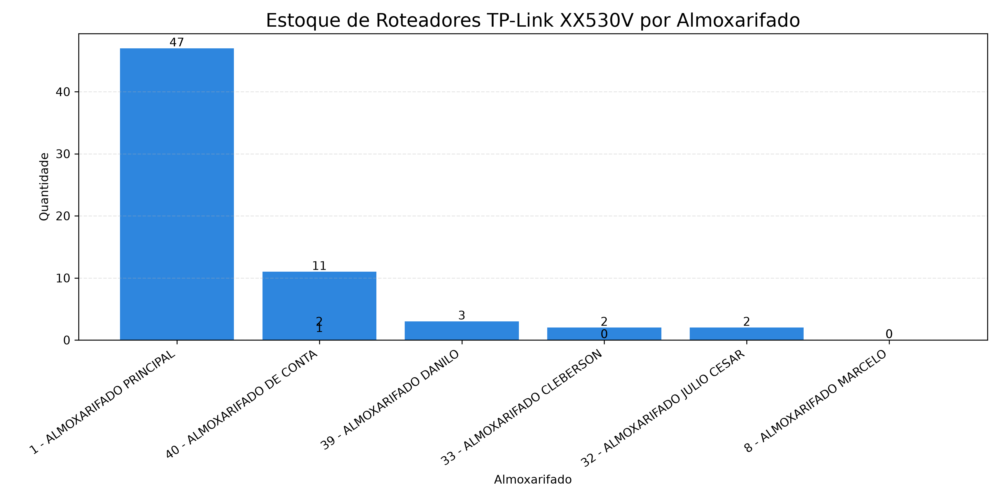

# 📊 Análise de Estoque XX530V

Projeto desenvolvido em Python para análise do estoque de equipamentos XX530V utilizando dados anonimizados de uma operação de telecomunicações.

Este foi um dos primeiros projetos desenvolvidos durante minha formação em Análise de Dados, servindo como base para projetos mais completos publicados neste portfólio.

---

## 🎯 Objetivo

Analisar o estoque do equipamento XX530V para identificar:

- Quantidade disponível
- Situação do estoque
- Necessidade de reposição
- Indicadores para acompanhamento operacional

---

## 🛠️ Tecnologias utilizadas

- Python
- Pandas
- Matplotlib
- CSV como base de dados
- Git e GitHub

---

## 📊 Indicadores analisados

Durante a análise foram avaliados:

- Quantidade total do equipamento
- Situação do estoque
- Distribuição dos registros
- Indicadores básicos de controle

---

## 📈 Resultado da análise

O projeto demonstra a utilização do Python para leitura, tratamento e visualização de dados de estoque, apresentando indicadores que auxiliam no acompanhamento operacional.

---

## 📊 Visualização gerada

#### Situação do estoque XX530V



---

## 📁 Estrutura

```
dados/
graficos/
src/
README.md
```

---

## 🚀 Evoluções futuras

- Dashboard interativo utilizando Power BI
- Automatização da leitura dos relatórios
- Indicadores comparativos entre períodos
- Integração com banco de dados

---

## 🔒 Observação

Os dados utilizados foram anonimizados para preservar informações internas da operação.